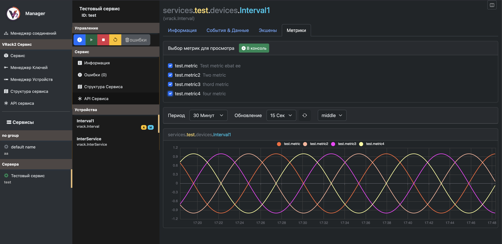
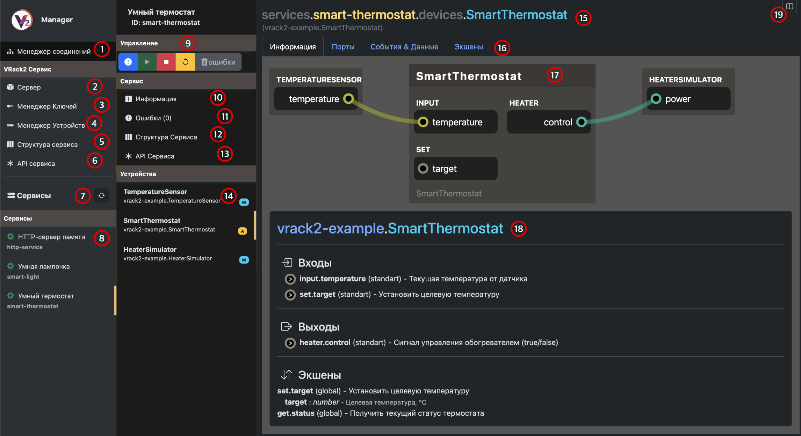

# VRack2 Manager

Интерфейс для администрирования VRack2.



 - [VRack2](https://github.com/VRack2/vrack2) - Основной репозиторий
 - [VGranite](https://github.com/VRack2/VGranite) - Сервис для создания туннелей Socket -> Serial
 - [VRack2-Core](http://github.com/VRack2/vrack2-core) - Фреймворк для создания событийно-ориентированных сервисов на JavaScript/TypeScript
 - [VRack-Remote](https://github.com/VRack2/vrack2-remote) - Библиотека для связи с VRack2 которую использует VRack2 Manager

## Установка

### Склонируйте репозиторий

```
git clone https://github.com/VRack2/vrack2-manager
```

### Смените директорию 

```
cd ./vrack2-manager
```

### Установите зависимости

```
npm install
```

### Запустите менеджер

```
npm run serve
```

## Описание интерфейса

После подключения к VRack2 вы увидите интерфейс для работы с разными инструментами и сервисами. Ниже приведено описание основных функций 



 1. Переход обратно - к менеджеру соединений
 2. Информация о сервере, потребление памяти и сетевая активность
 3. Менеджер ключей - добавление/удаление ключей доступа
 4. Менеджер устройств - отображает доступные устройства и их информацию
 5. Структура сервиса самого VRack2
 6. Документация на динамическое основное API VRack2
 7. Обновление списка сервисов
 8. Выбор конкретного сервиса
 9. Управление сервисом - проверка/запуск/остановка/перезапуск/удаление ошибок сервиса
 10. Основная информация о сервисе, пути до файлов, потребление памяти
 11. Критические ошибки сервиса
 12. Структура конкретного сервиса
 13. Документация на динамическое API конкретного сервиса
 14. Выбор конкретного устройства конкретного выбранного сервиса (флаг "М" означает наличие метрик а флаг "А" наличие экшенов)
 15. Информация о выбранном устройстве, его сервис и путь
 16. Вкладки для работы с устройством - Информация/Порты/События и Shares данные/Экшены/Метрики
 17. Локальная схема соединения устройства
 18. Более подробная информация о устройстве
 19. Кнопка переключения **Консоли**
  
-----

**Что бы не терять данные и не выполнять одни и теже действия - пользуйтесь консолью**, см. пункт 19. Она предназначена именно для того, что бы раз в сессию подписываться на нужные каналы и экшены и выполнять их и отслеживать в рамках одной сессии

----